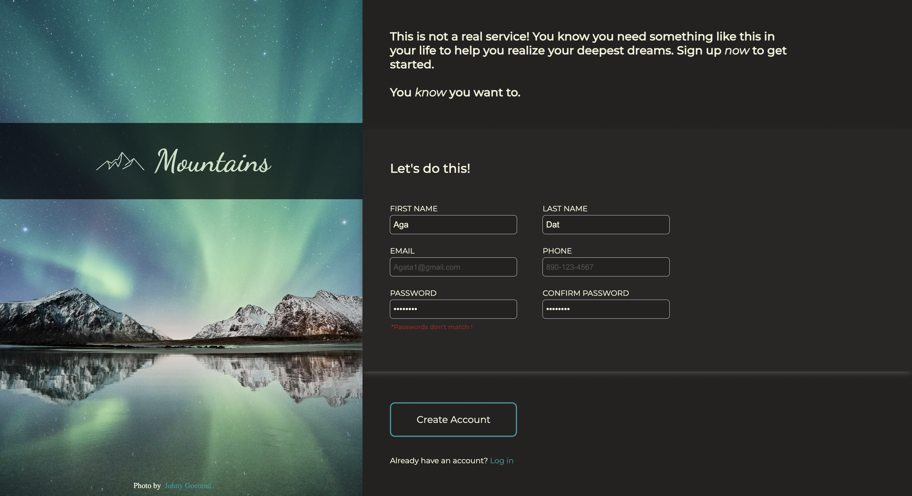

# Sign-up form  for imaginary service

## Table of Contents
* [General Info](#general-information)
* [Technologies](#technologies)
* [Screenshots](#screenshots)
* [Link to game](#link-to-game)
* [Setup](#setup)
* [Usage](#usage)

## General information
It's a sign up form that let me explored and practised form validation and styling. Task is one of the assignments from [The Odin Project](https://www.theodinproject.com/lessons/node-path-intermediate-html-and-css-sign-up-form) .

## Technologies
* CSS3
* HTML5
* JavaScript

## Screenshots

## Link to webpage
https://agata10.github.io/sign-up-form/

## Setup

1. Fork repository 
or
2. Clone reposiory
   `git clone https://github.com/YOUR-USERNAME/YOUR-REPOSITORY`

## Usage
It's a simple sign-up form which populate the parsed info into url of webpage after submitting. 
The form is using validation: 
1. First/Last name: accepts only letters
2. Number has to have format with - (123-123-1234)
3. Password has to have 8 characters, 1 letter and 1 number
4. To confirm password I used onchange event on both inputs. If the passwords do not match, the submit button is disabled and error is poped out.